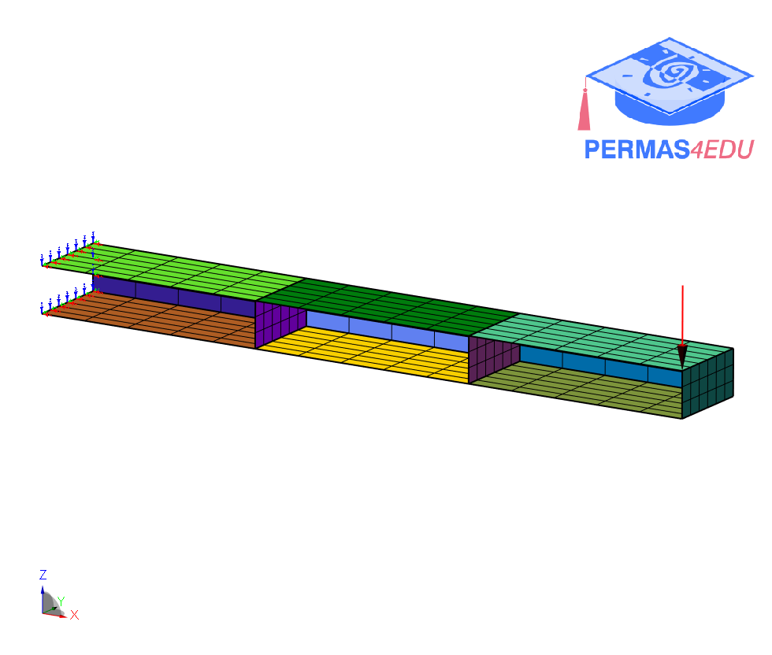

***
[⬅️](../008/README.md "Previous example")
[➡️](../010/README.md "Next example")
***

The example is adapted from [Generalized polynomial chaos expansion by reanalysis using static condensation based on substructuring](https://doi.org/10.1007/s10483-024-3108-8)

