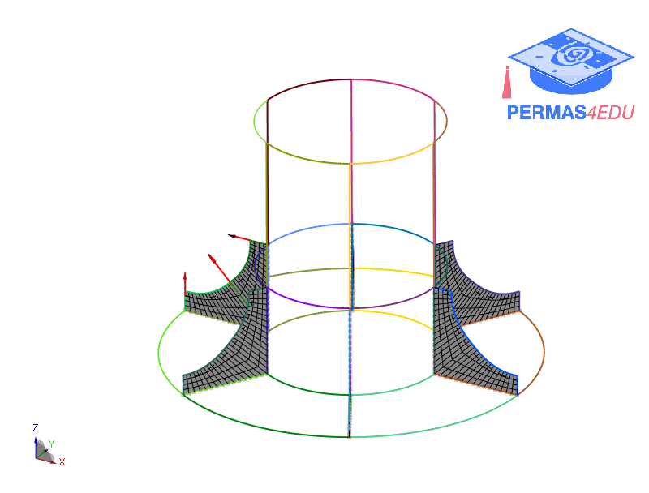
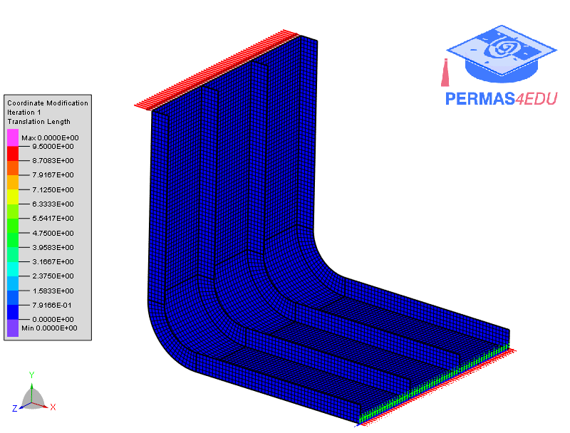

***
[⬅️](../009/README.md "Previous example")
[➡️](../011/README.md "Next example")
***

The examples are adapted from [Parameter-free optimum design method of stiffeners on thin-walled structures](https://doi.org/10.1007/s00158-013-0954-1)

