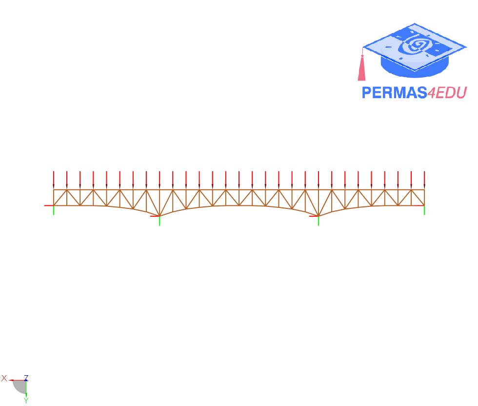

The example is adapted from [An efficient algorithm for multi-objective structural optimization problems using an improved pbest-based differential evolution algorithm](https://doi.org/10.1016/j.advengsoft.2024.103752)

Thanks to Hoang-Anh Pham for sharing further information about the 113bar-truss bridge. His support is greatly appreciated.

