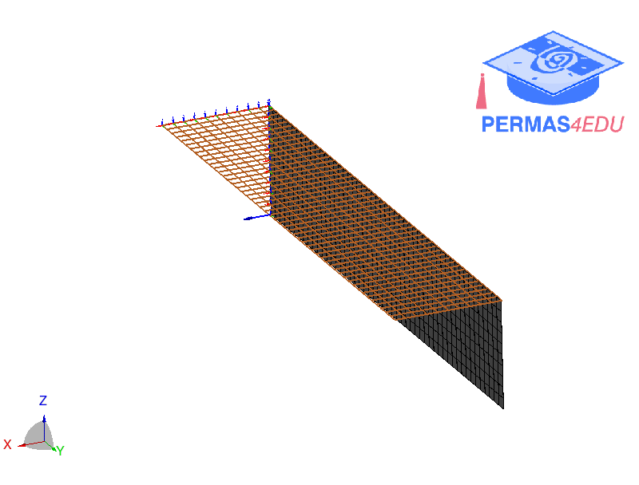

***
[⬅️](../012/README.md "Previous example")
[➡️](../014/README.md "Next example")
***

The example is adapted from [Automated shape and thickness optimization for non‑matching isogeometric shells using free‑form deformation](https://doi.org/10.1007/s00366-024-01947-7)

