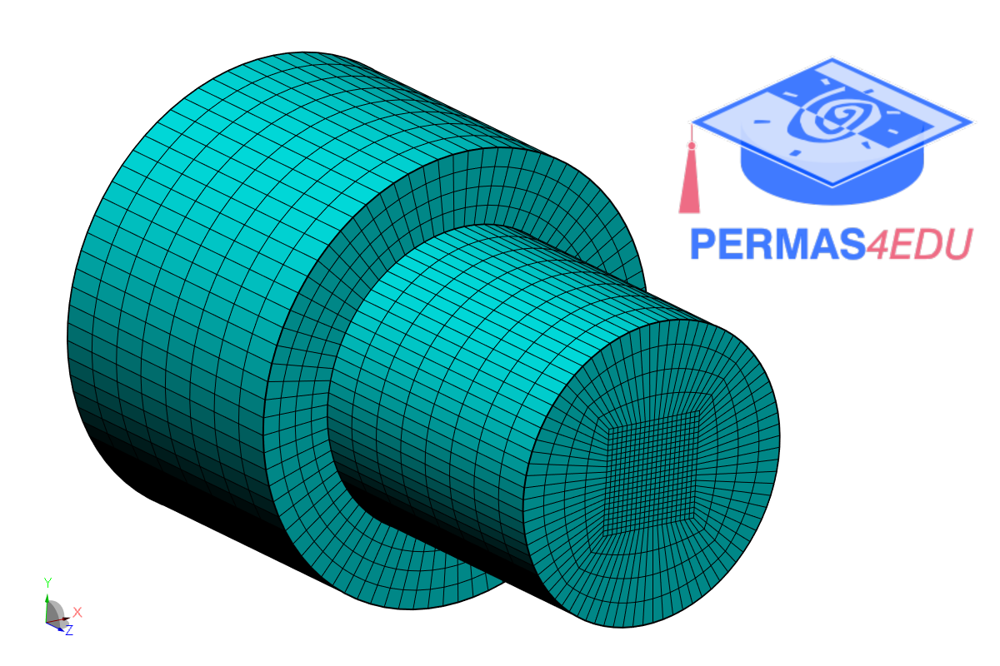

***
[⬅️](../016/README.md "Previous example")
[➡️](../018/README.md "Next example")
***

The example is adapted from [Shape optimization applied in minimizing stress concentration factors: a case study for manufacturable shaft design](https://doi.org/10.1007/s40430-024-05355-2)

