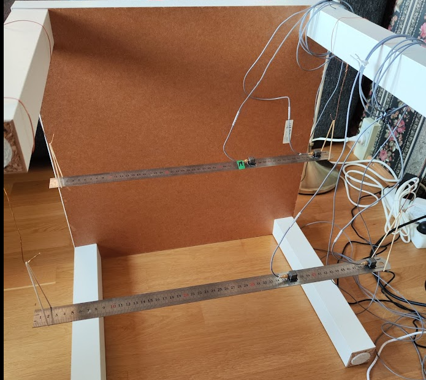
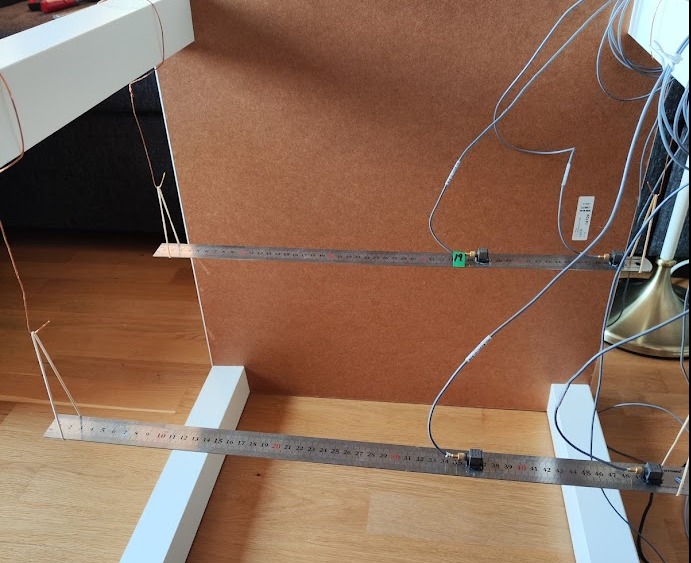

***
[⬅️](../017/README.md "Previous example")
[➡️](../019/README.md "Next example")
***

The example illustrates FEMU of a beam. The measurements were carried out by Dmitri Tcherniak. Many thanks for providing the data.
Two accelerometers are attached to the beam. The error sum of squares of the first three natural frequencies is to be minimised using parametric optimisation.

$$\min f(x) = \min c_0 + \sum\limits_{i=1}^3 c_i \left[\frac{x_i -\bar{x}_i}{{\bar x}_i}\right]^2 $$ s.t. $$\underline{m} \le m \le \overline{m}$$

### Design variables

$$d_1 = z_1 $$ position of the first accelerometer
$$d_2 = z_2 $$ position of the second accelerometer,
$$d_3 = E $$ Youngs modulus,
$$d_4 = \rho $$ density,
$$d_5 = h $$ height,
$$d_6 = w $$ width

### Experimental set-up

