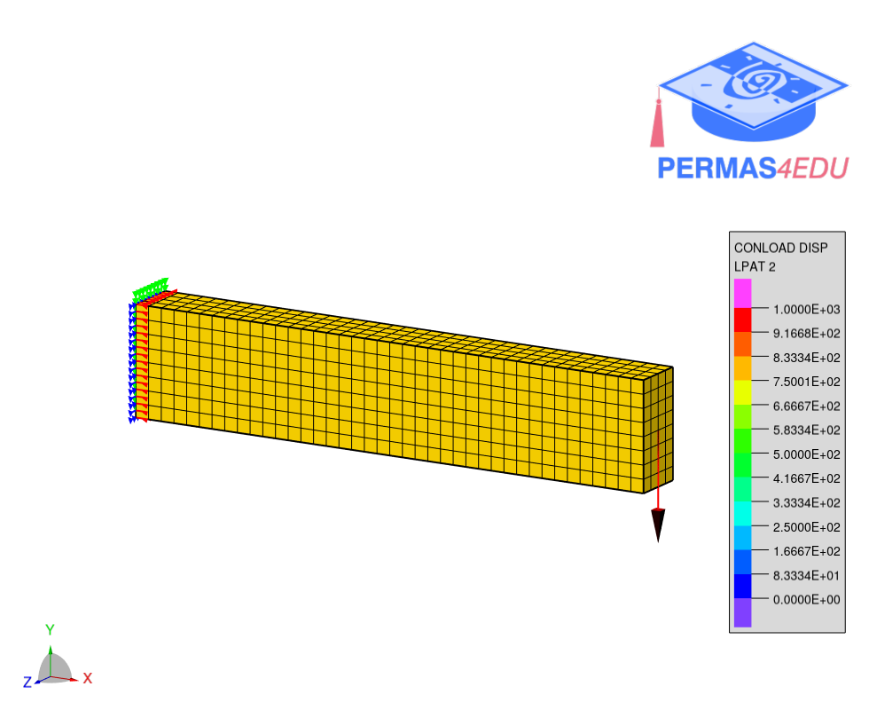

***
[⬅️](../018/README.md "Previous example")
[➡️](../020/README.md "Next example")
***

The example is adapted from [Automatic shape optimisation of structural parts driven by BGM and RBF mesh morphing](https://doi.org/10.1016/j.ijmecsci.2020.105976)

