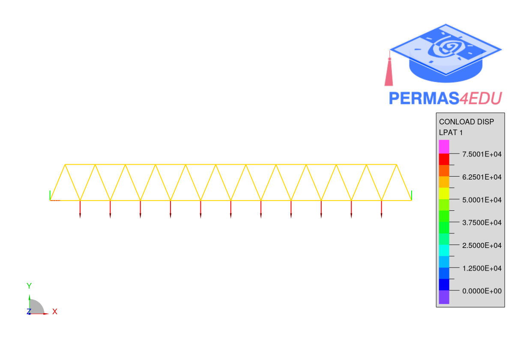

The example is adapted from [A differentiable structural analysis framework for high-performance design optimization](https://doi.org/10.1016/j.istruc.2025.109292)

Thanks to Keith J. Lee for private communication. His support is greatly appreciated.

