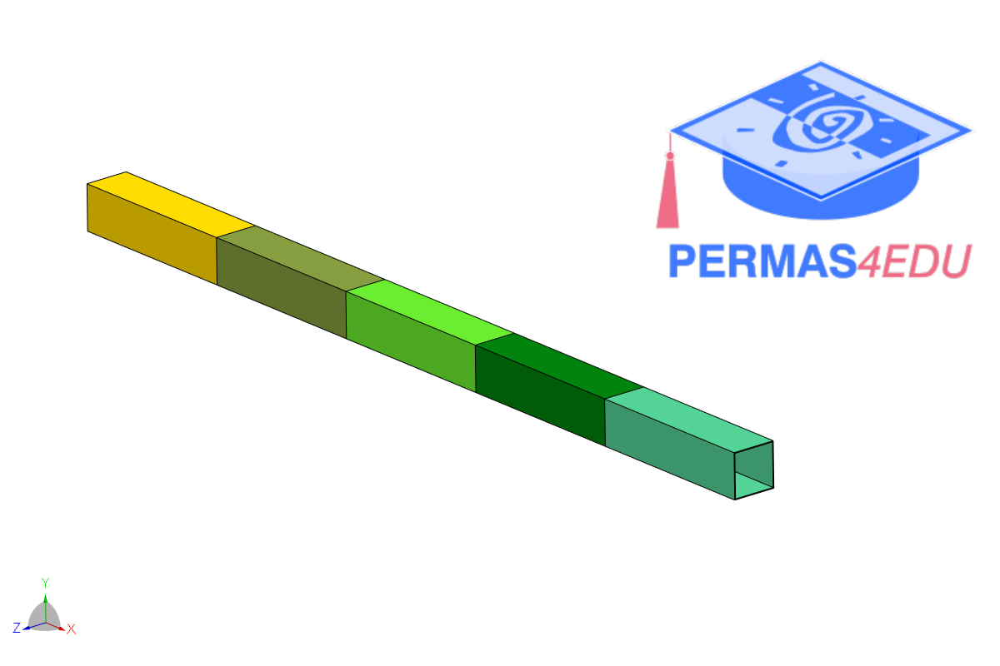

***
[⬅️](../023/README.md "Previous example")
[➡️](../025/README.md "Next example")
***

The example is adapted from [Artificial neural network–infused polar fox algorithm for optimal design of vehicle suspension components](https://doi.org/10.1515/mt-2025-0043)

