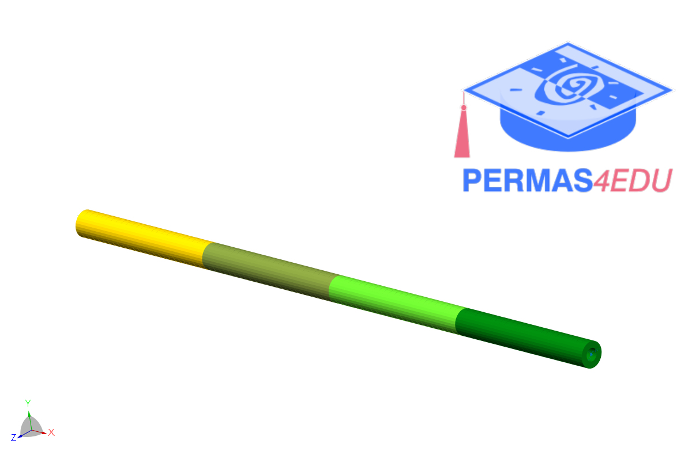

The example is adapted from [MULTIMODAL ROTOR-DYNAMIC OPTIMIZATION BASED ON TRANSFER MATRIX METHOD FOR DIFFERENT ROTOR STRUCTURES](http://dx.doi.org/10.1115/GT2025-152092)

Design variables

$$x_1 = d^{(1)}_o$$
$$x_2 = d^{(2)}_o$$
$$x_3 = d^{(3)}_o$$
$$x_4 = d^{(4)}_o$$
$$x_5 = t^{(1)}$$
$$x_6 = t^{(2)}$$
$$x_7 = t^{(3)}$$
$$x_8 = t^{(4)}$$

$$d_o$$ : outer diameter hollow shaft

$$t$$ : wall thickness
