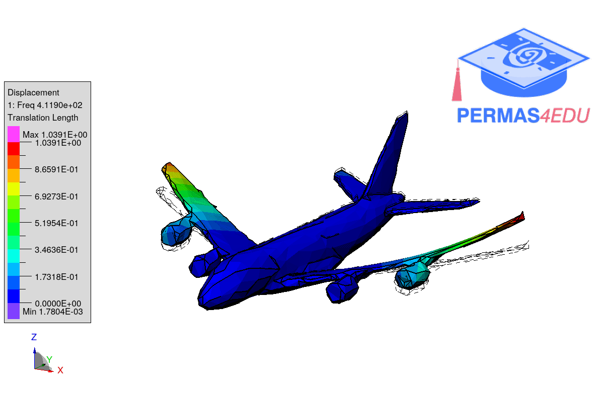

The example is adapted from [Omnidirectional multi-view high-speed-camera-based full-field 3D modal identification](https://doi.org/10.1016/j.ymssp.2025.113415)

We are very grateful to Krištof Čufar and Janko Slavič for sharing the .stl file of the airplane model and for their helpful private communication. Their support was invaluable.

