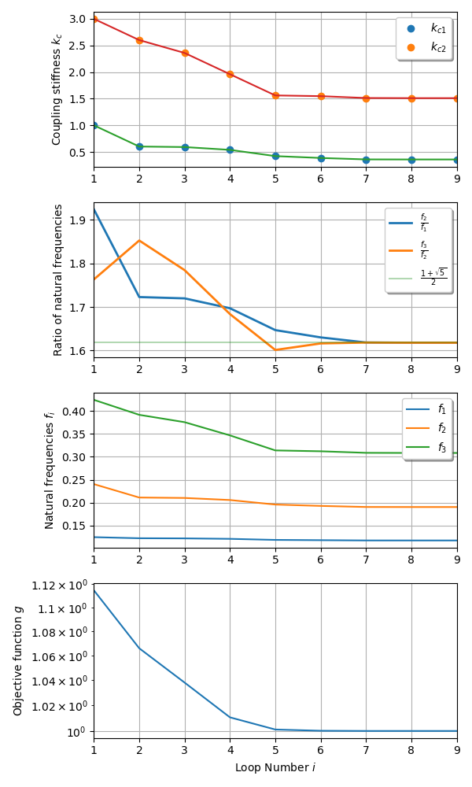

***
[⬅️](../034/README.md "Previous example")
[➡️](../036/README.md "Next example")
***

### The Extended Golden Oscillator

$$ {\boldsymbol M}  = m \begin{bmatrix} 1 & 0  & 0 \\ 
0 & 1 & 0 \\
0 & 0 & 1 \end{bmatrix}, \quad m=1 $$

$$ {\boldsymbol K}  = \begin{bmatrix} k+k_{c1} & -k_{c1} & 0 \\ 
-k_{c1} & k_{c1}+k_{c2} & -k_{c2} \\
0 & -k_{c2} & k+k_{c2}
\end{bmatrix}, \quad k=1 $$

Find $$k_1, k_2$$ such that 

$$\frac{f_3}{f_2}=\frac{f_2}{f_1} = \frac{1+\sqrt{5}}{2}$$

