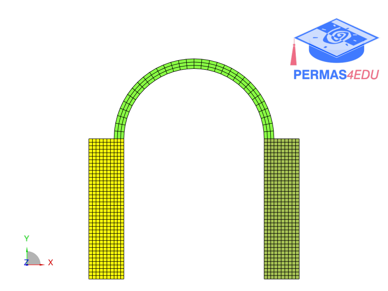

***
[⬅️](../036/README.md "Previous example")
[➡️](../README.md "Go up one directory level")
***

The example is adapted from [Regularization in Structural Model Updating in the Presence of Noisy Data](https://doi.org/10.1002/nme.70113)

