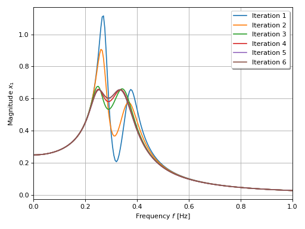
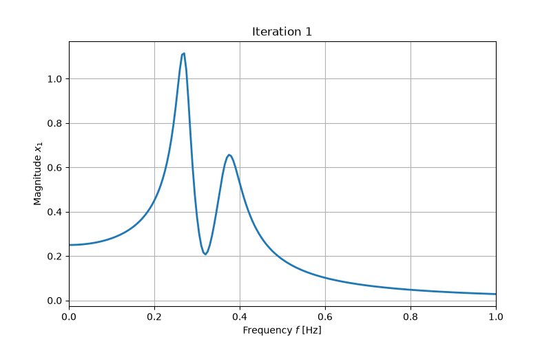

***
[⬅️](../039/README.md "Previous example")
[➡️](../README.md "Go up one directory level")
***
The example is adapted from [Optimising classical and non-traditional tuned mass dampers topology in deterministic and random vibration environments](https://doi.org/10.1016/j.probengmech.2026.103989)

Thanks to Yubin Gu for private communication.

