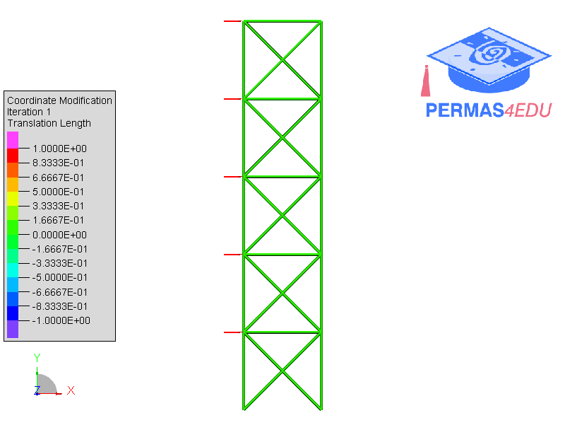

***
[⬅️](../040/README.md "Previous example")
[➡️](../README.md "Go up one directory level")
***
The example is adapted from [Comparative evaluation of optimization algorithms for truss shape design](https://doi.org/10.1108/EC-08-2025-0946)

