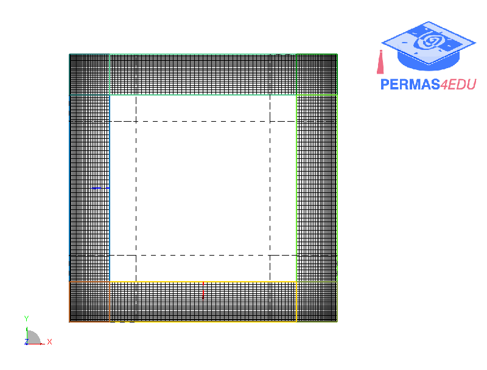
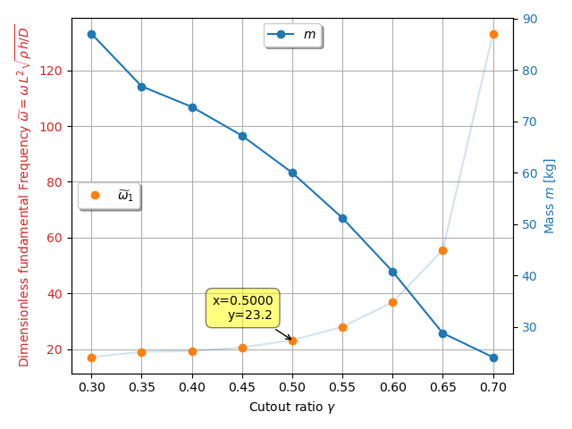

The example is adapted from [Mass lumping schemes fitted to MLS-based numerical manifold method in vibration of plates with cutouts using CPT and FSDT](https://doi.org/10.1016/j.compstruct.2023.117815)

 
