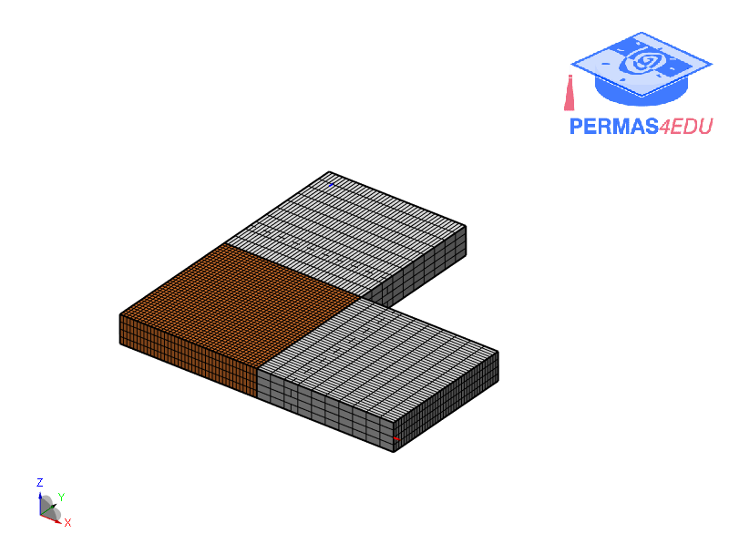

***
[⬅️](../005/README.md "Previous example")
[➡️](../007/README.md "Next example")
***

The example is adapted from [New Analytic Free Vibration Solutions of L-Shaped Moderately Thick Plates by Symplectic Superposition](https://doi.org/10.1142/S0219455424502572)

