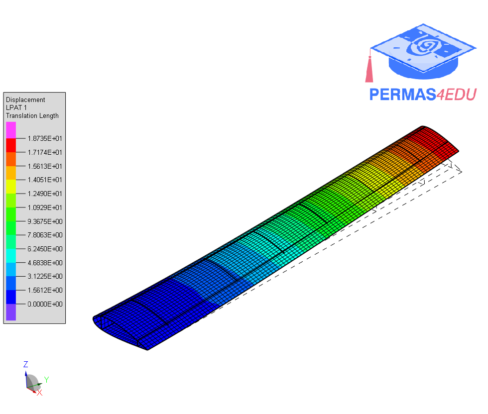

***
[⬅️](../007/README.md "Previous example")
[➡️](../009/README.md "Next example")
***

The example is adapted from [Shape optimization of non-matching isogeometric shells with moving intersections](https://arxiv.org/abs/2407.00185)
Thanks to Professor Chen for private communication and sharing the CAD model of the eVTOL wing geometry. His support is greatly appreciated.

 
