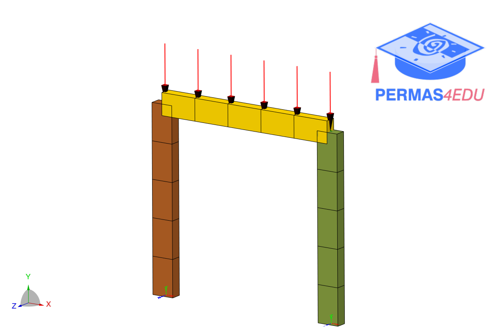

***
[⬅️](../008/README.md "Previous example")
[➡️](../010/README.md "Next example")
***

The example is adapted from [A novel interval matrix stiffness method for the analysis of steel frames with uncertain semi-rigid connections](https://doi.org/10.1016/j.advengsoft.2024.103629)

Thanks to Alba Sofi for private communication. Her support is greatly appreciated.

