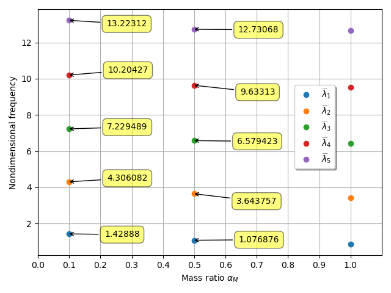

***
[⬅️](../010/README.md "Previous example")
[➡️](../012/README.md "Next example")
***

The example is adapted from [On the importance and application of the extended Galerkin’s method to distributed systems](http://dx.doi.org/10.1177/03064190241298202)

Thanks to Serkan Zeren for private communication. His support is greatly appreciated.

