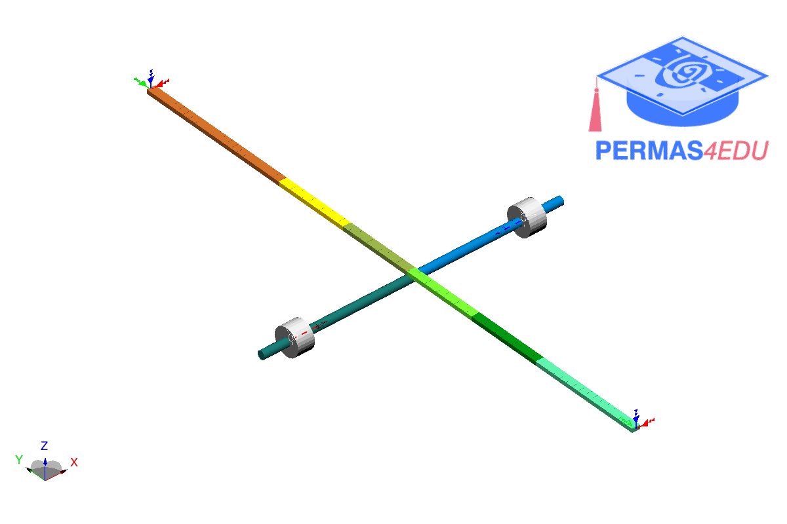

***
[⬅️](../012/README.md "Previous example")
[➡️](../014/README.md "Next example")
***

The example is adapted from [Efficient Two-Stage Modal Identification for Structures with Closely Spaced Modes by Bayesian Fft and Joint Approximate Diagonalization](http://dx.doi.org/10.2139/ssrn.4956434)

