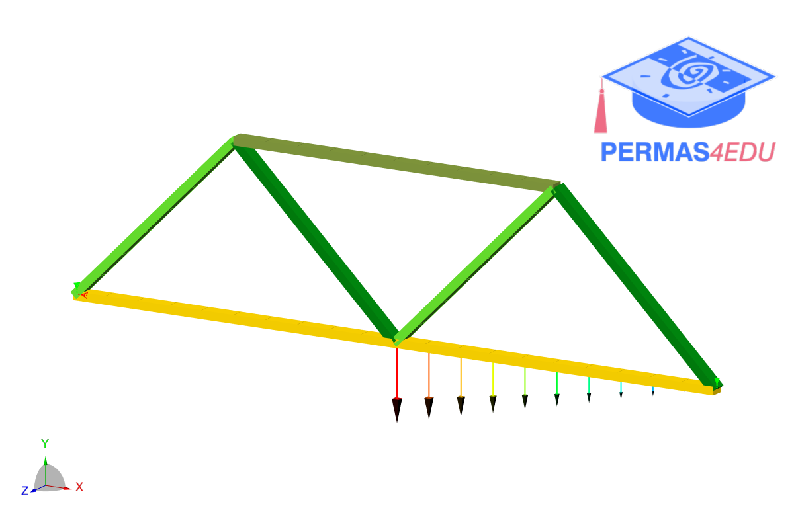

***
[⬅️](../013/README.md "Previous example")
[➡️](../015/README.md "Next example")
***

The example is adapted from [Physics-informed deep operator networks with stiffness-based loss functions for structural response prediction](https://doi.org/10.1016/j.engappai.2025.110097)

