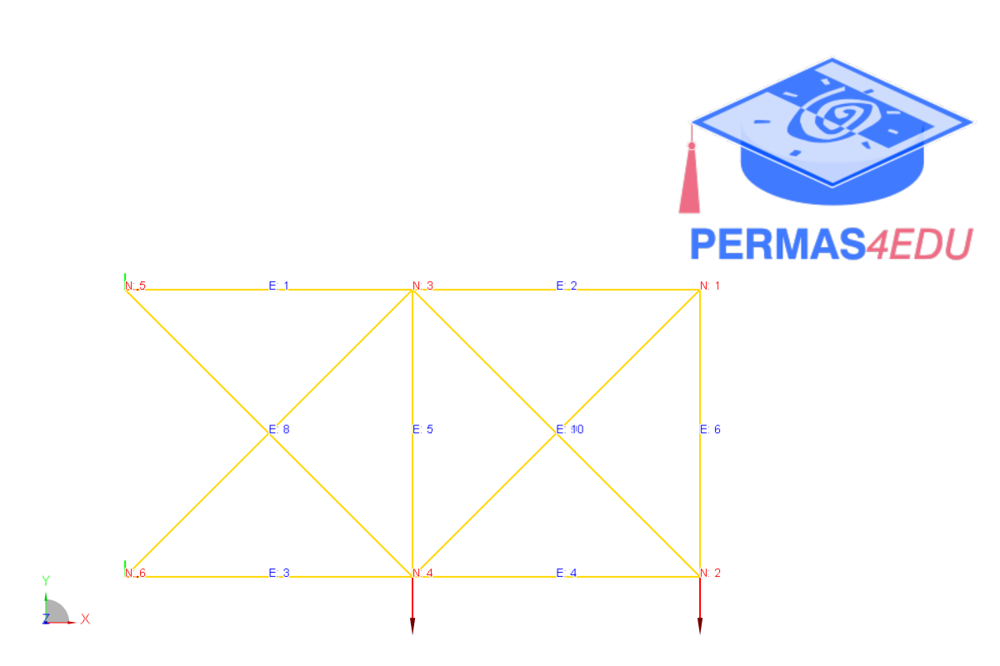

***
[⬅️](../016/README.md "Previous example")
[➡️](../018/README.md "Next example")
***

The example is adapted from [Exploring the Predictive Performance of Simple Regression Models and ANN in 2D Truss Analysis](https://doi.org/10.1007/978-3-031-69626-8_123)

