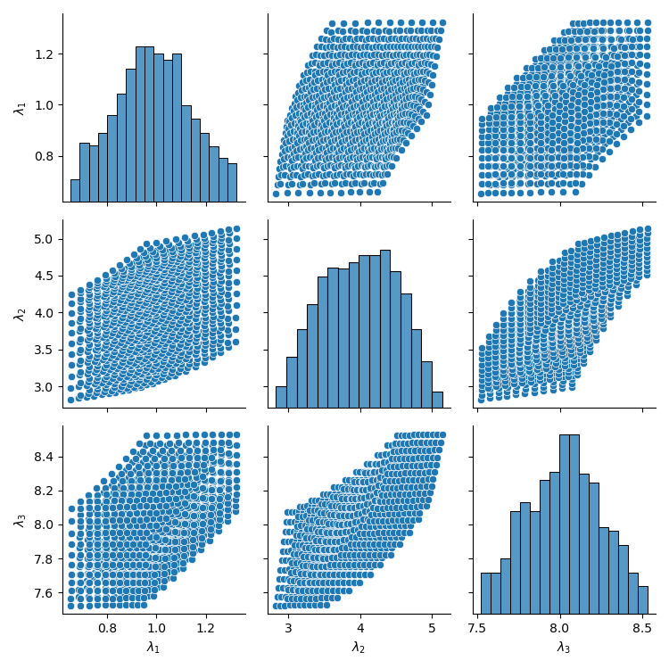
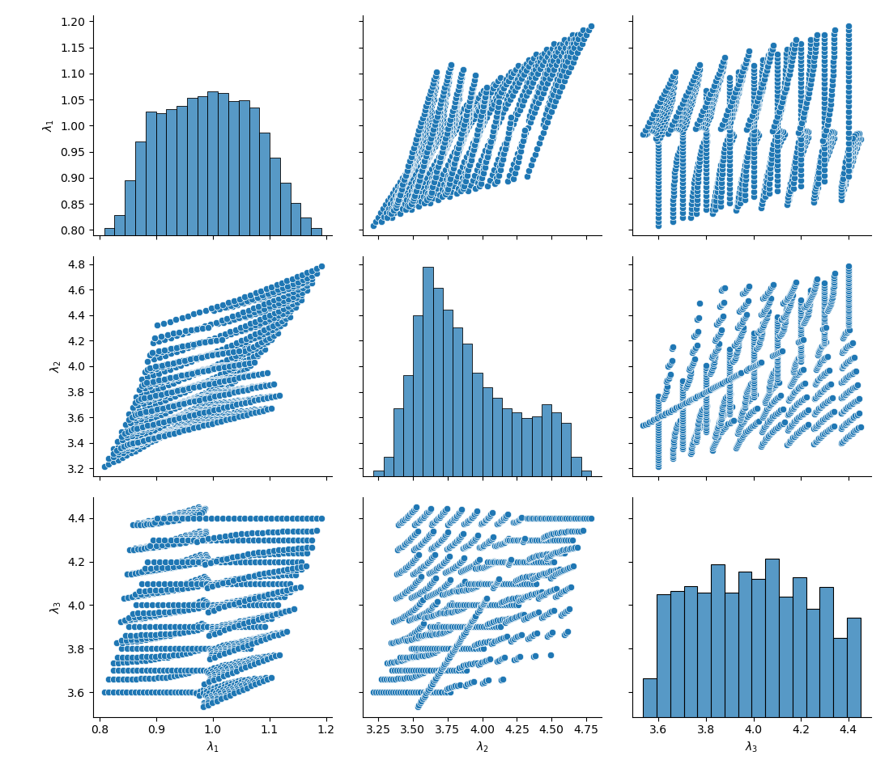

***
[⬅️](../017/README.md "Previous example")
[➡️](../019/README.md "Next example")
***

The example is adapted from [Optimization algorithm for uncertain model updating based on interval overlap ratios and Chebyshev polynomials](https://doi.org/10.1016/j.apm.2024.115864)

### Well-separated modes

### Close modes

