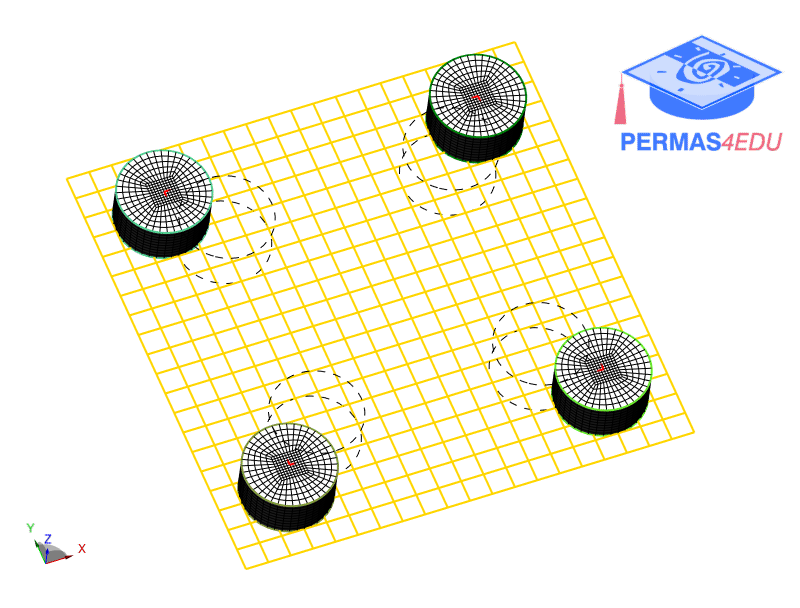

***
[⬅️](../018/README.md "Previous example")
[➡️](../020/README.md "Next example")
***

The example is adapted from [Maximization of fundamental frequency for small satellite components layout design](https://doi.org/10.1016/j.asr.2024.11.079)

