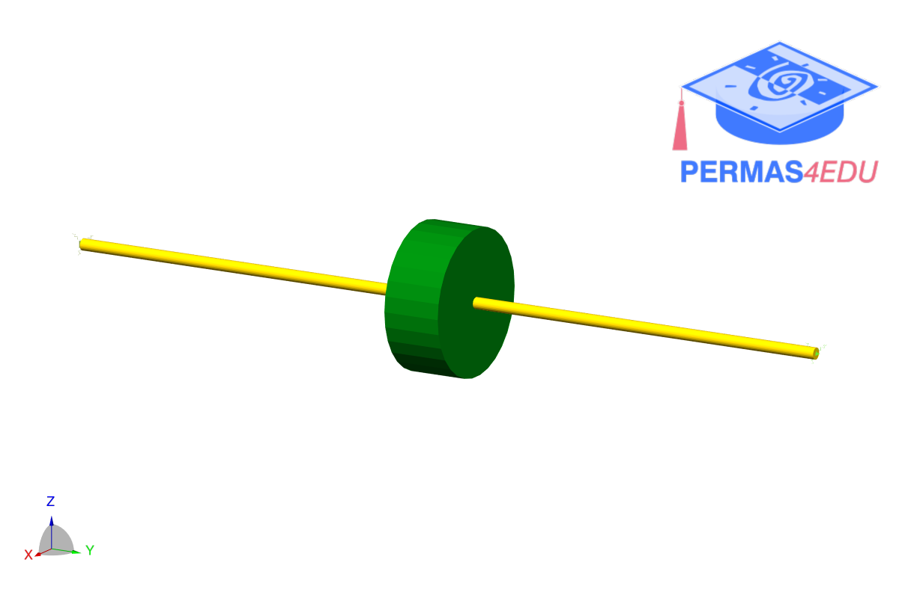

***
[⬅️](../027/README.md "Previous example")
[➡️](../029/README.md "Next example")
***

The example is adapted from [Numerical prediction and experimental validation of on onboard rotor under bending](https://doi.org/10.1007/s11012-021-01392-6)

