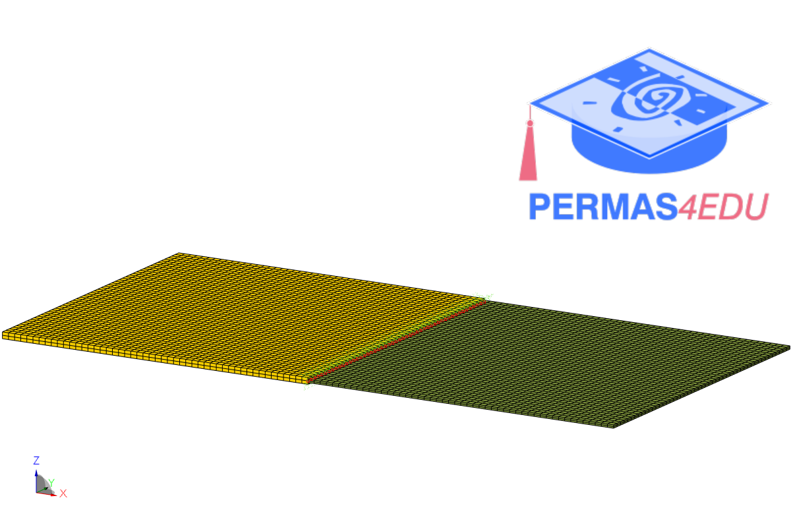

***
[⬅️](../030/README.md "Previous example")
[➡️](../032/README.md "Next example")
***

The example is adapted from [A singular value decomposition component mode synthesis method for built-up structures](https://doi.org/10.1016/j.tws.2025.113826)

