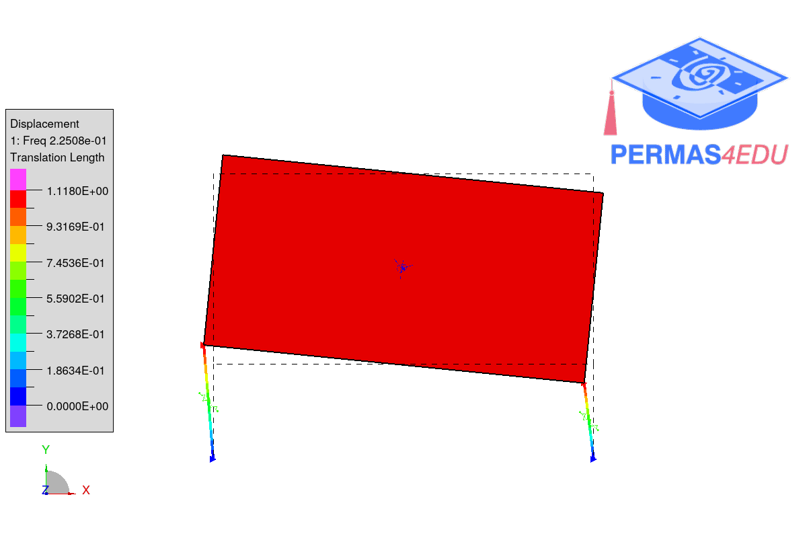
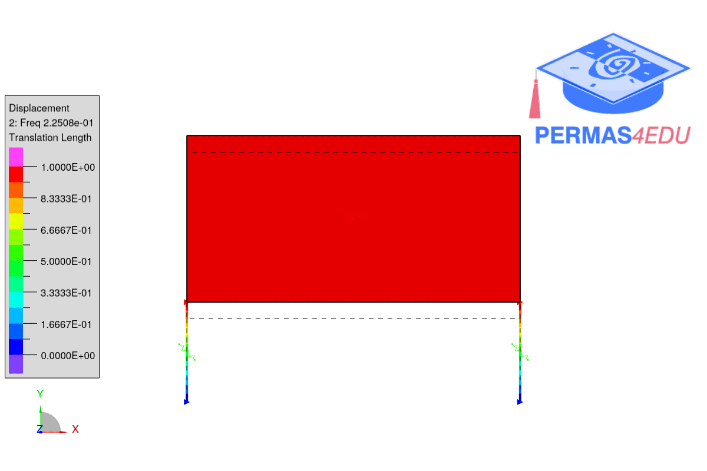
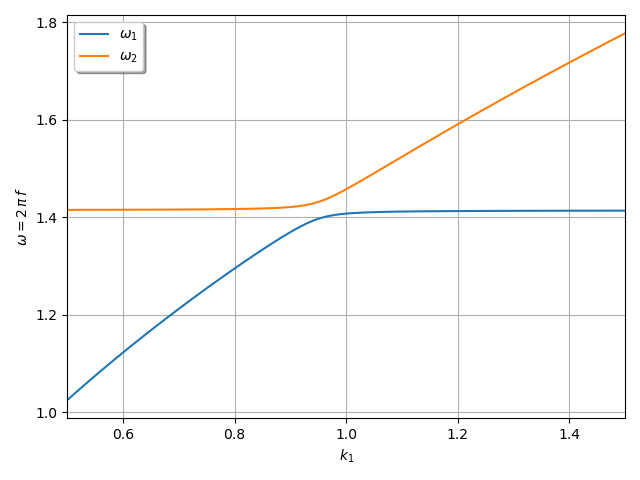

***
[⬅️](../031/README.md "Previous example")
[➡️](../033/README.md "Next example")
***

The example is adapted from [A novel approach to surrogate modelling of modal properties: Mode-shape-adapted input parameter domain cutting](https://doi.org/10.1016/j.ymssp.2025.113381)

