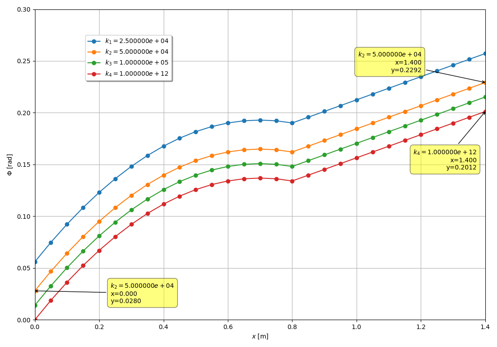

***
[⬅️](../032/README.md "Previous example")
[➡️](../034/README.md "Next example")
***

The example is adapted from a LinkedIn post. Thanks to Lonny Thompson for sharing the [Compliant Support Fixture problem](https://www.linkedin.com/posts/lonny-thompson_compliant-support-torsion-challenge-part-activity-7384913594288885761-TnUe?utm_source=share&utm_medium=member_desktop&rcm=ACoAAAKPHp0BbZDYvs6O4FWW34in8GbmY8ZMl7Q).

