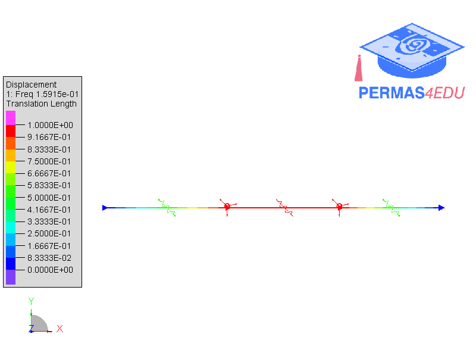

### The Golden Oscillator

$$ {\boldsymbol M}  = \begin{bmatrix} 1 & 0 \\ 
0 & 1 \end{bmatrix} $$

$$ {\boldsymbol K}  = \begin{bmatrix} k+k_c & -k_c \\ 
-k_c & k+k_c \end{bmatrix} $$

$$f_1 = 0.1591549 $$ [Hz]

$$f_2 = 0.2575181 $$ [Hz]

$$\frac{f_2}{f_1}= \frac{1+\sqrt{5}}{2}$$

