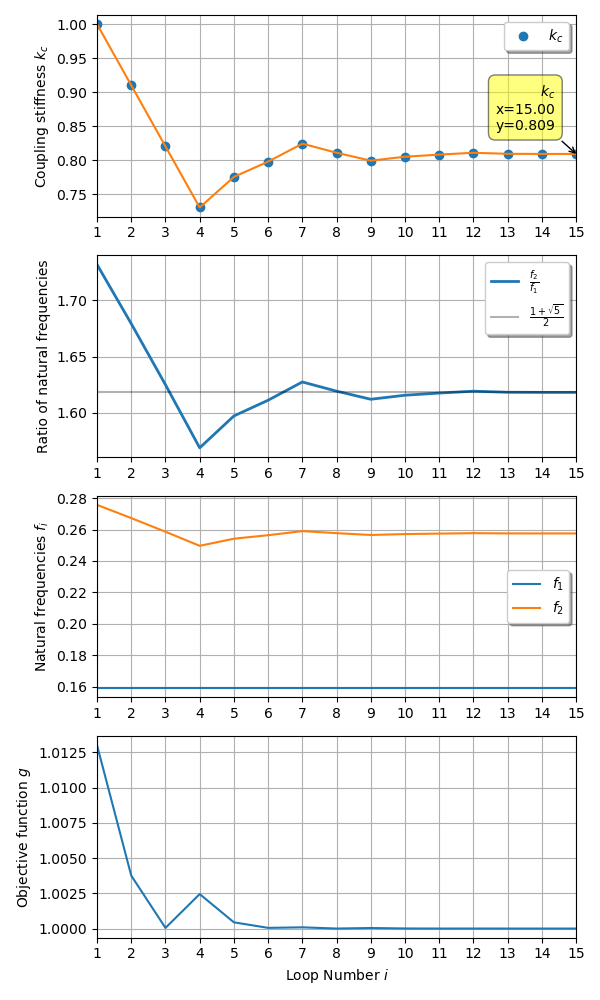

***
[⬅️](../035/README.md "Previous example")
[➡️](../README.md "Go up one directory level")
***

The example is adapted from [LinkedIn](https://www.linkedin.com/feed/update/urn:li:activity:7419950293913673728/)

### The Golden Oscillator

$$ {\boldsymbol M}  = m \begin{bmatrix} 1 & 0 \\ 
0 & 1 \end{bmatrix} $$

$$ {\boldsymbol K}  = \begin{bmatrix} k+k_c & -k_c \\ 
-k_c & k+k_c \end{bmatrix} $$

$$ m=1, k = 1,  \quad k_c = \frac{1+\sqrt{5}}{4} $$

$$f_1 = 0.1591549 $$ [Hz]

$$f_2 = 0.2575181 $$ [Hz]

$$\frac{f_2}{f_1}= \frac{1+\sqrt{5}}{2}$$

### Optimization problem

### The Extended Golden Oscillator

$$ {\boldsymbol M}  = m \begin{bmatrix} 1 & 0  & 0 \\ 
0 & 1 & 0 \\
0 & 0 & 1 \end{bmatrix} $$

$$ {\boldsymbol K}  = \begin{bmatrix} k+k_1 & -k_1 & 0 \\ 
-k_1 & k_1+k_2 & -k_2 \\
0 & -k_2 & k+k_2
\end{bmatrix} $$

Find $$k_1, k_2$$ such that 

$$\frac{f_3}{f_2}=\frac{f_2}{f_1} = \frac{1+\sqrt{5}}{2}$$

