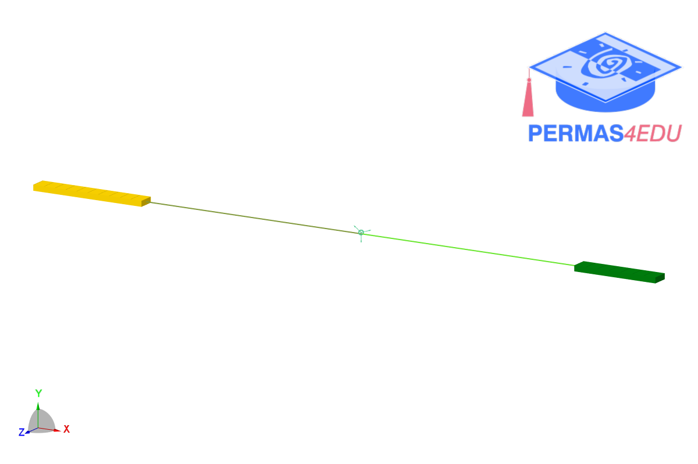

***
[⬅️](../037/README.md "Previous example")
[➡️](../039/README.md "Next example")
***

The example is adapted from [Frequency Model of Fixed-Ends Collinear System with Two Flexible Members and One Rigid Connector by Lumped-Parameter, Compliance-Based Matrix Method](https://doi.org/10.3390/vibration9010009)

