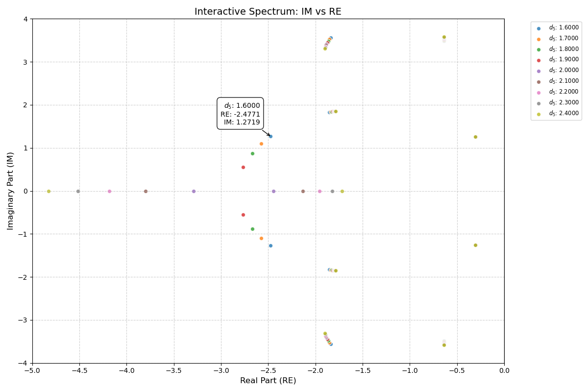

***
[⬅️](../039/README.md "Previous example")
[➡️](../041/README.md "Next example")
***

The example is adapted from [Diagonalising Isospectral Flows for Linear Second Order Dynamical Systems](https://doi.org/10.1016/j.jsv.2026.119923)

