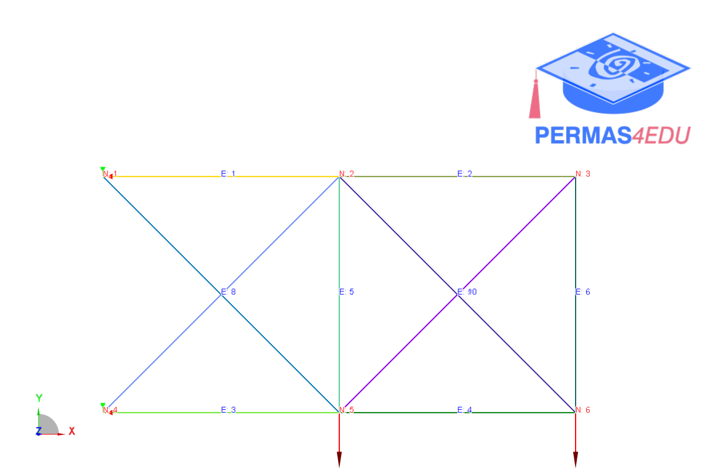
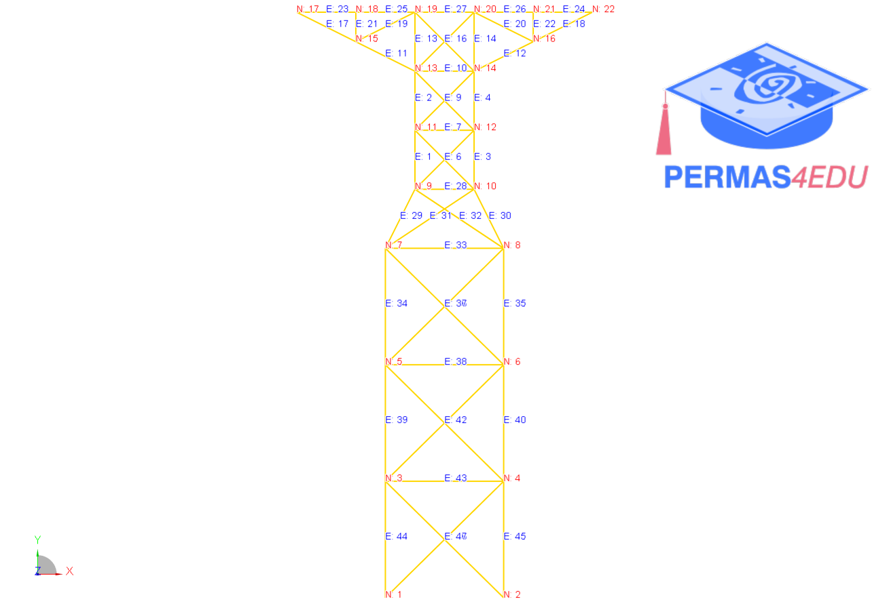

***
[⬅️](../042/README.md "Previous example")
[➡️](../044/README.md "Next example")
***
The examples are adapted from [Efficient graph neural networks for predicting the responses of truss structures](https://doi.org/10.1007/s00366-026-02365-7)

## 10 bar truss

## 47 bar truss

