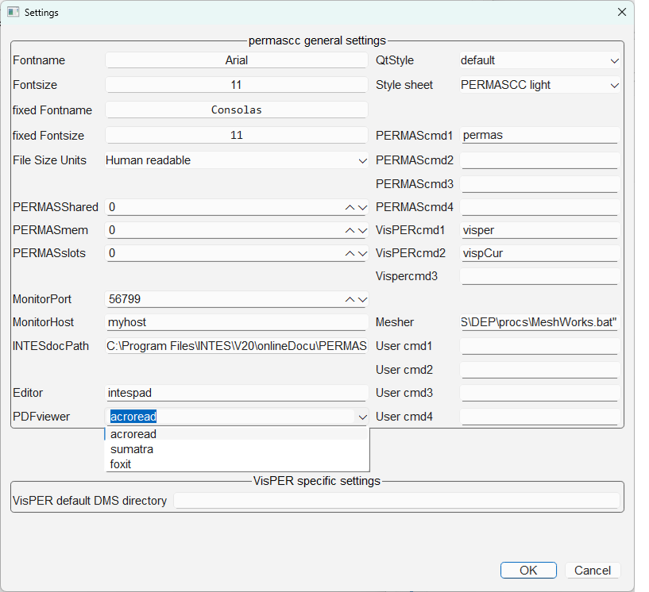
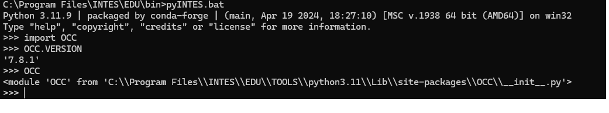
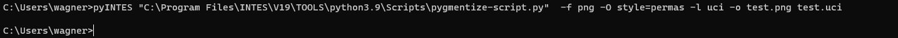

### intespad

 * Enhanced text editor  
 * Syntax Highlighting  
 * Direct link to the users manual (UM-450) via the F1 key / pause key
 * Convenient jumping to specific messages
 * Show and Hide (all) DAT contents
 * Many shortcuts, e.g. function keys F4, F5, F6 to name a few


### emacsgold

For larger .dat files, we recommend using the emacs editor with an emacsGold extension. 
You might want to associate the file extensions .dat, .pro, .res with the Windows Batch File C:\Program Files\INTES\EDU\bin\emacsGold.bat .
A configuration file .emacs_gold is needed in your %AppData% folder. The default for context help is the ‘Pause’ key.
The following lines in .emacs_gold assign the context help function to the F1 key, for example:

```
(global-set-key [f1] (key-binding [help]))
(define-key GOLD-map [f1] (key-binding [gold help]))
```
The key F5 can be used to jump to the first comment/warning/error message if you edit your .res .pro file with emacsGold.

### PDF viewer

* sumatra
* acroread
* foxit



### permasgraph
#### Supported file formats

 * .hdf
 * .post .post.gz .post.zst
 * .csv
 * .xy PERMAS xy gnuplot files
 * .x I-DEAS, MEDINA, Patran xy-data
 


### pyINTES Enhanced Python Interpreter



| Module | Version V19 | Version V20 | Version V21 |
|----    | ----    | ---- |  ---- |
| bokeh | 2.4.2 | 3.5.2 | 3.9.1 |
| conda | | 24.7.1 |  26.5.3 |
| contourpy |  | 1.2.1 | 1.3.3   |
| cython | N/A | 3.0.11 | 3.2.6  |
| derivative | N/A | 0.6.2 | 0.6.3   |
| hdf5view | N/A | 0.1.1 |  0.2.7   |
| h5py   | 3.6.0 | 3.11.0 | 3.16.0   |
| imageio | 2.9.0 | 2.35.1 | 2.37.0  |
| jinja2 | | 3.1.4 | 3.1.6   |
| joblib | | 1.4.2 | 1.5.3   |
| json | | 2.0.9 | 2.0.9    |
| lxml | | 5.3.0 |  6.0.2   |
| mamba | N/A | 1.5.8 |  N/A  |
| matplotlib | 3.5.1 | 3.9.2  | 3.10.9    |
| meshio | 5.3.4 | 5.3.5 |  5.3.5    |
| mplcursors | 0.5.1 | 0.5.3 | 0.7.1.   |
| mpld3 | 0.5.7 | 0.5.10 |  0.5.12   |
| mpmath | 1.2.1 | 1.3.0 |  1.4.1   |
| narwhals | N/A | N/A | 2.22.1 |
| numexpr | | 2.10.0 |  2.14.1 |
| numpy  | 1.22.3  | 1.26.4 | 2.5.0   |
| numpy-stl | 2.17.1 | 3.1.2 | 4.0.0   |
| OCC | 7.4.1-dev | 7.8.1  |  7.9.0   |
| openpyxl | 3.0.9 | 3.1.5 |  3.1.5   |
| pandas | 1.4.2   | 2.2.2 |  3.0.3   |
| PIL    | 9.0.1   | 10.4.0 |  12.2.0  |
| pip    |     | 24.2 |   26.1.2   |
| plotly | 5.6.0 |  5.23.0 | 6.8.0    |
| psutil | | 6.0.0 |  7.2.2    |
| pyDOE2 | 1.3.0 | N/A  |  N/A   |
| pyDOE3 | N/A   | 1.0.4  | N/A   |
| pydoe  | N/A | N/A | 1.0.1 |
| pygments | | 2.18.0  | 2.20.0    |
| PySide6 |N/A | 6.5.3 | 6.8.3    |
| pytest | N/A| 8.3.2 |   9.1.1   |
| python-docx | 0.8.11 | 1.1.2 | 1.2.0    |
| python-pptx | 0.6.21 | 1.0.2  | 1.0.2   |
| pywt | 1.3.0 | 1.7.0  |  N/A   |
| pyzstd | | 0.16.1 |  0.19.1   |
| requests |  | 2.32.3  | 2.34.2     |
| scikit-image | 0.19.2 | 0.24.0  | 0.26.0   |  
| scikit-learn | 1.0.2 | 1.5.1 |  1.9.0   |
| scipy  | 1.7.3   |  1.14.1|  1.18.0   |
| seaborn | 0.11.2 |  0.13.2 |  0.13.2   |
| setuptools | | 72.2.0 | 82.0.1   |
| smt | 1.1.0 | 2.6.3 | 2.14.0   |
| sphinx |  | 8.0.2 | 9.1.0   |
| statsmodels | | 0.14.2 | 0.14.6   |
| sympy | 1.10.1 | 1.13.2 | 1.14.0  |
| tables | 3.6.1 | 3.10.1 | 3.11.1  |
| tornado |  | | 6.5.7 |
| vitables | 3.0.2 | N/A | N/A   |
| wheel | | 0.44.0 |     |
| xlsxwriter | 3.0.3 | 3.2.0 |  3.2.9  |

### Log files from the installation

Windows users may find a log file of the installation process in %AppData%\Local\Temp

Linux users will find a file ~/.INTESsetupLOG

### Miscellaneous

#### pack_permas_job


#### pygmentize

##### Examples for Linux Users

```bash
pygmentize -f png -O style=permas -l dat -o test_dat.png test.dat
pygmentize -f png -O style=permas -l uci -o test_uci.png test.uci
pygmentize -f png -O style=permas,line_numbers=False -l uci -o test_uci_no_line_numbers.png test.uci
pygmentize -f svg -O style=fruity -l bash -o test_sh.svg test.sh
```

##### Example for Windows Users

  

  

### Other CAD formats

IGES format (.igs/.iges) is currently not supported by VisPER. However, you might use Open CASCADE to convert .iges to .step.

```bash
pyINTES iges2step.py <your_geometry.igs> 
```
