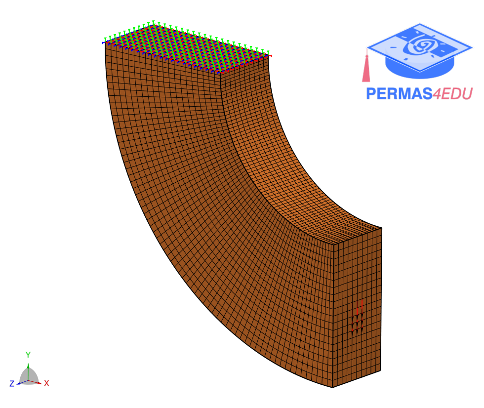

***
[⬅️](../README.md "Go up one directory level")
[➡️](../002/README.md "Next example")
***

The example is taken from [OPS-ITO: Development of Isogeometric Analysis and Topology Optimization in OpenSEES for Free-Form Structural Design](https://doi.org/10.1016/j.cad.2023.103517)

