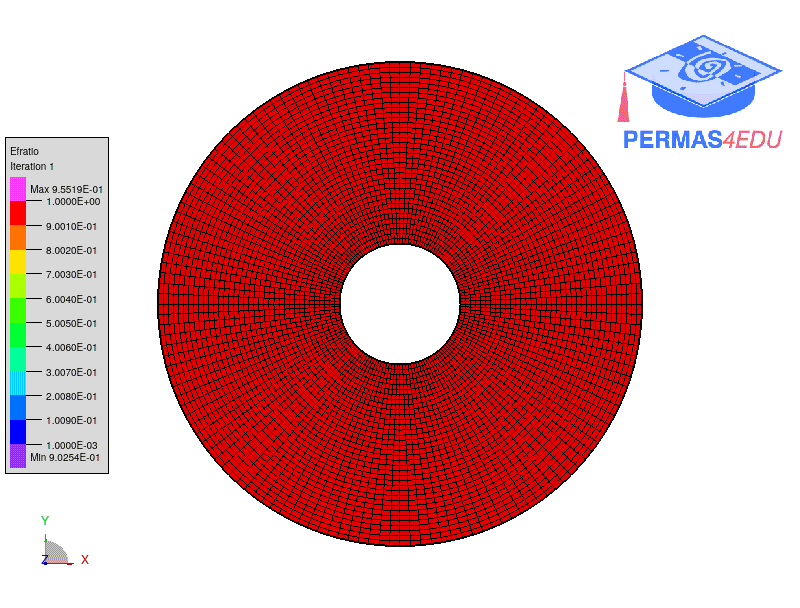
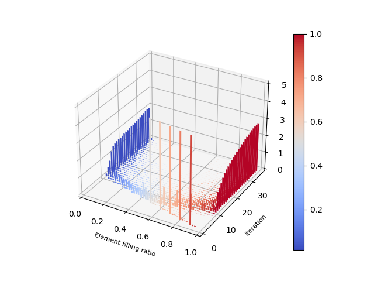

***
[⬅️](../003/README.md "Previous example")
[➡️](../005/README.md "Next example")
***

The example is taken from [Bi-directional evolutionary topology optimization of continuum structures subjected to inertial loads](https://doi.org/10.1016/j.advengsoft.2020.102897)

