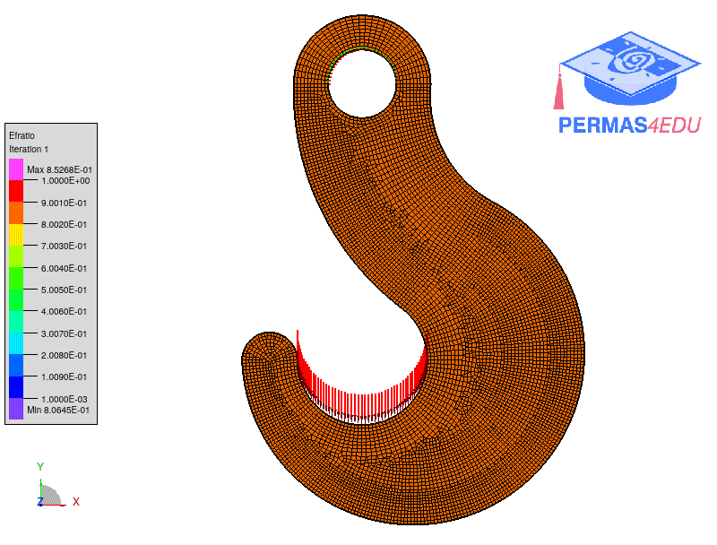

***
[⬅️](../004/README.md "Previous example")
[➡️](../006/README.md "Next example")
***

The example is taken from [Inverse and direct projection schemes for topology optimization using polygonal elements](https://www.researchgate.net/publication/347079140_Inverse_and_direct_projection_schemes_for_topology_optimization_using_polygonal_elements)

