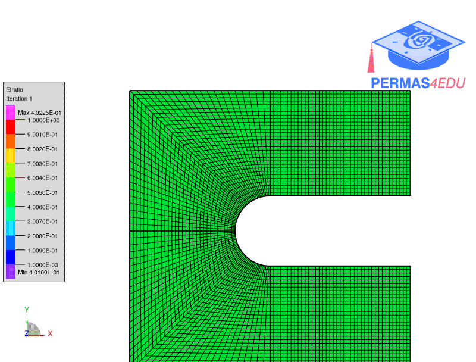

***
[⬅️](../005/README.md "Previous example")
[➡️](../007/README.md "Next example")
***

The example is adapted from [An improved partial differential equation filter scheme for topology optimization of additively manufactured coated structure](https://doi.org/10.1016/j.compstruc.2023.107147)

