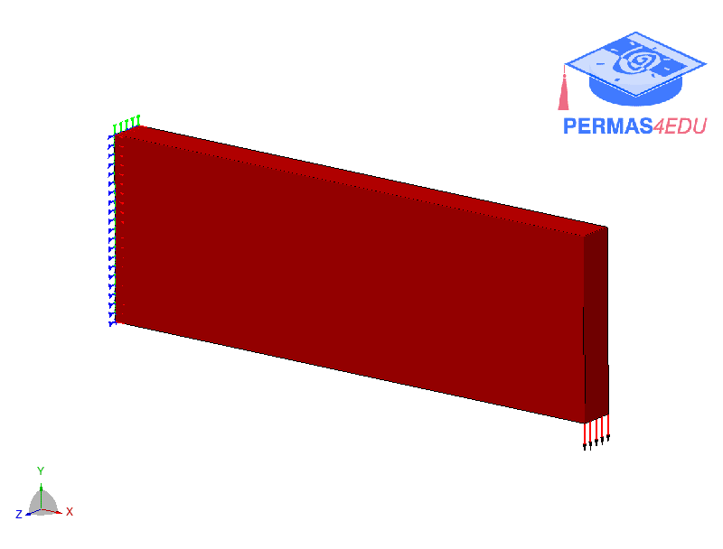

***
[⬅️](../006/README.md "Previous example")
[➡️](../008/README.md "Next example")
***

The example is adapted from [A Hybrid Parallel Strategy for Isogeometric Topology Optimization via CPU/GPU Heterogeneous Computing](https://doi.org/10.32604/cmes.2023.029177)

