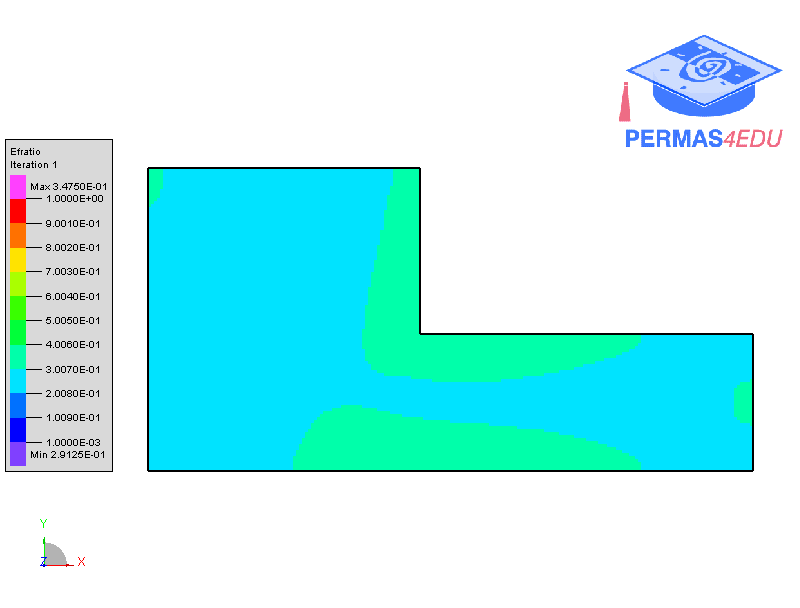

***
[⬅️](../008/README.md "Previous example")
[➡️](../010/README.md "Next example")
***

The example is adapted from [Topology Optimization under a Single Displacement Constraint Using a Strain Energy Criterion](https://doi.org/10.3390/applmech4020031)

