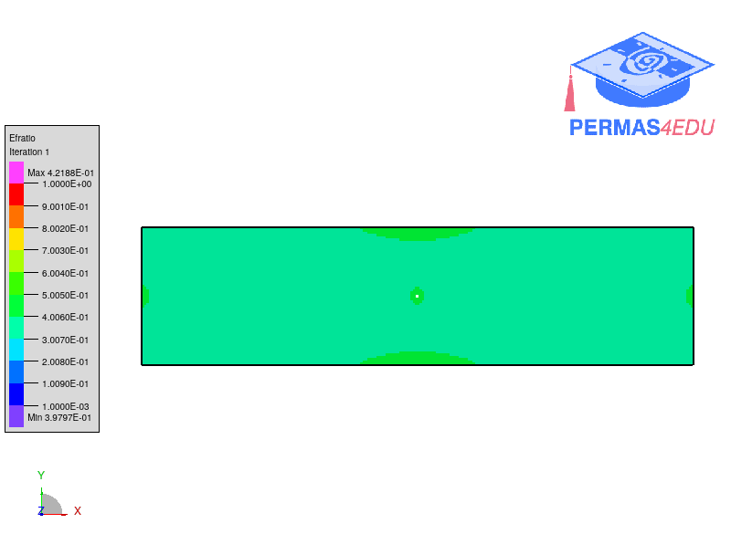

***
[⬅️](../009/README.md "Previous example")
[➡️](../011/README.md "Next example")
***

The example is adapted from [Non-penalization topology optimization for maximizing natural frequency using SEMDOT](https://www.researchgate.net/publication/372506078_Non-penalization_topology_optimization_for_maximizing_natural_frequency_using_SEMDOT)

