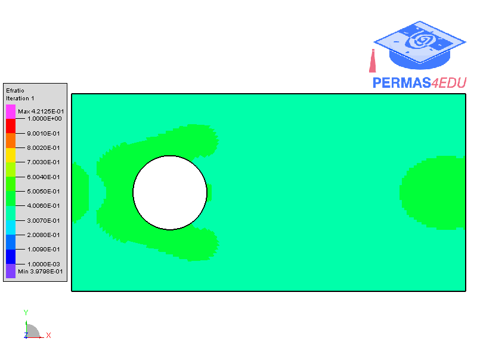

The example is adapted from [Stress Minimization of Structures Based on Bidirectional Evolutionary Procedure](https://doi.org/10.1061/(ASCE)ST.1943-541X.0002264)
Thanks to Professor Xiaodong Huang for private communication.

