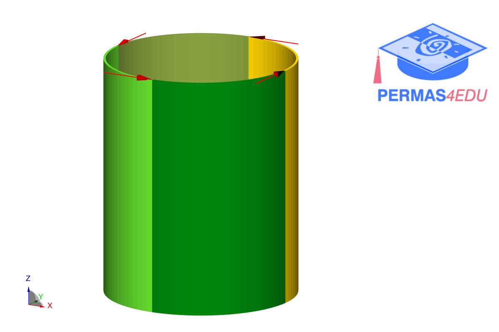

***
[⬅️](../012/README.md "Previous example")
[➡️](../014/README.md "Next example")
***

The example is adapted from [Full-scale isogeometric topology optimization of cellular structures based on Kirchhoff-Love shells](https://www.techscience.com/CMES/v139n3/55627)

