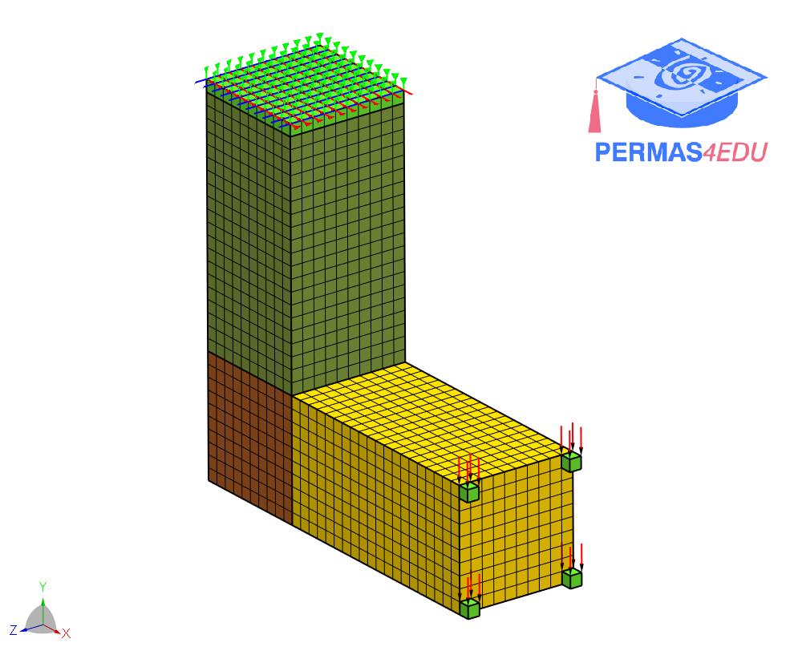

***
[⬅️](../014/README.md "Previous example")
[➡️](../016/README.md "Next example")
***

The example is adapted from [Plate manufacturing constraint in topology optimization using anisotropic Helmholtz filter](http://dx.doi.org/10.21203/rs.3.rs-3623856/v1)

