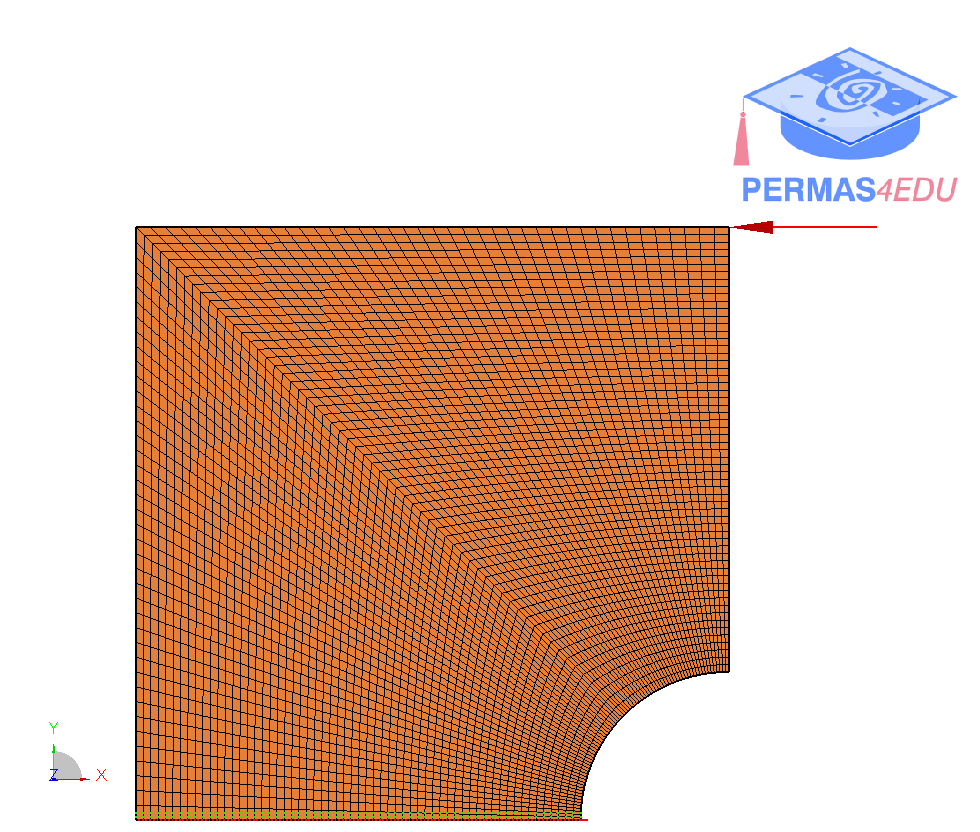
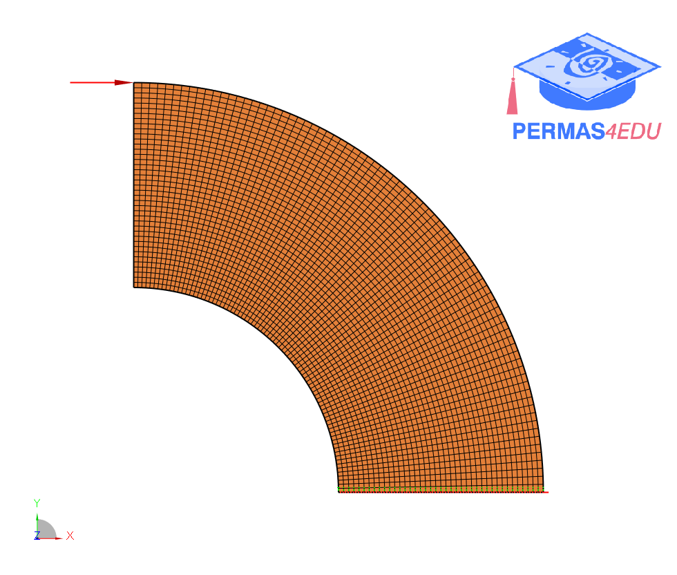

***
[⬅️](../017/README.md "Previous example")
[➡️](../019/README.md "Next example")
***

The example is adapted from [An efficient isogeometric topology optimization based on the adaptive damped geometric multigrid method](https://doi.org/10.1016/j.advengsoft.2024.103712)

