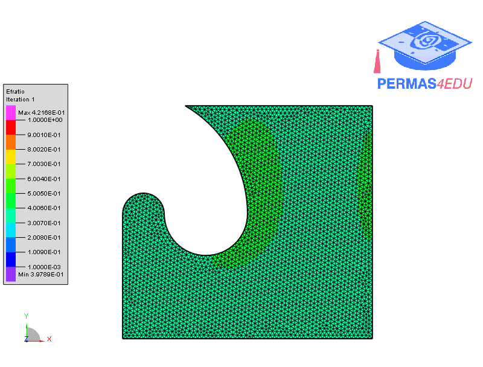
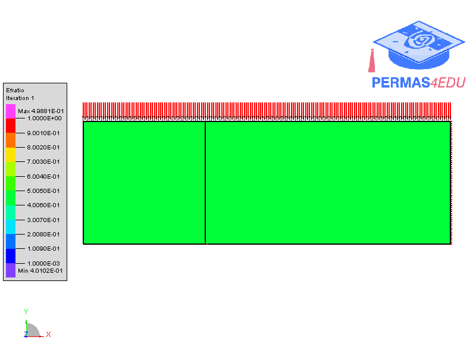

***
[⬅️](../018/README.md "Previous example")
[➡️](../020/README.md "Next example")
***

The example is adapted from [Achieving self‑supported enclosed voids and machinable support structures in topology optimization for additive manufacturing](https://doi.org/10.1007/s00158-024-03858-z)

