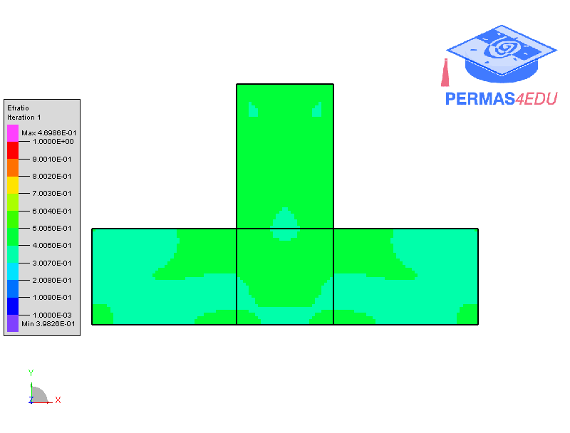
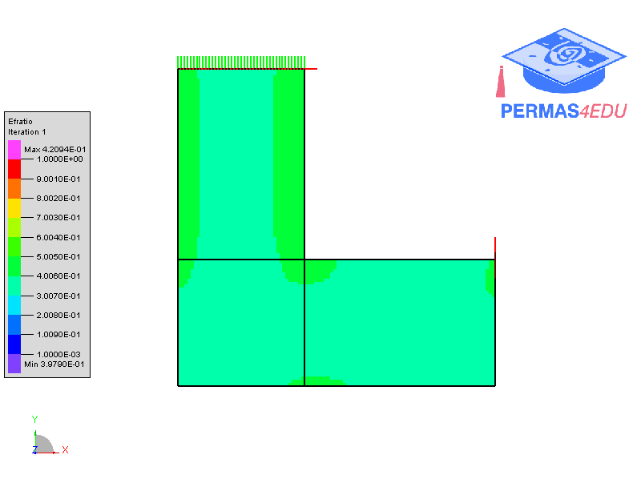

***
[⬅️](../019/README.md "Previous example")
[➡️](../021/README.md "Next example")
***

The example is adapted from [An improved evolutionary structure optimization method considering stress minimization and smooth design](https://doi.org/10.1002/nme.7551)

