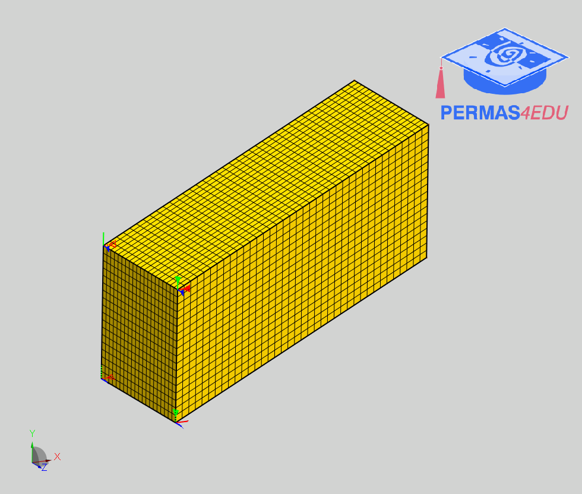

***
[⬅️](../020/README.md "Previous example")
[➡️](../022/README.md "Next example")
***

The example ia adapted from [Voxel‑based evolutionary topological optimization of connected structures for natural frequency optimization](https://doi.org/10.1007/s10999-024-09722-8)

# Design Wizard

https://github.com/permas4edu/permas4edu/blob/main/topo/examples/021/design_wizard_edu.mp4

