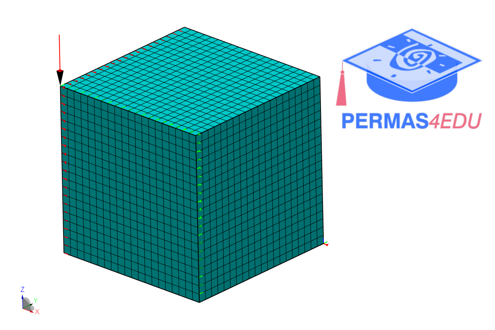

***
[⬅️](../024/README.md "Previous example")
[➡️](../026/README.md "Next example")
***

The example is adapted from [An explicit topology and thickness control approach in SIMP-based topology optimization](https://doi.org/10.1016/j.compstruc.2024.107631)

